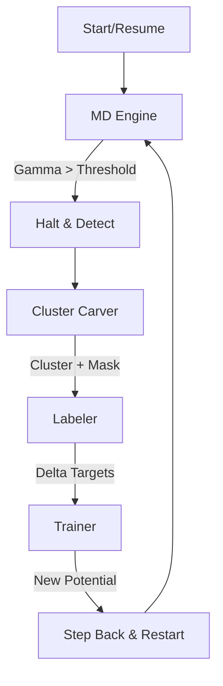

# ACE-Active-Carver Architecture Design

## 1. System Overview

**ACE-Active-Carver** is an automated Active Learning (AL) system designed to train Machine Learning Potentials (ACE) on-the-fly during Molecular Dynamics (MD) simulations. It employs a **Delta-Learning ($\Delta$-Learning)** strategy, where the ML potential learns the correction term between a baseline empirical potential (Lennard-Jones) and a high-fidelity reference (DFT).

### Core Philosophy
1.  **Uncertainty-Driven**: The simulation is driven by the ML potential until the model detects an extrapolation event (high uncertainty, measured by MaxVol $\gamma$).
2.  **Local Learning**: Instead of recalculating the entire system with DFT, only the local cluster causing the uncertainty is extracted and labeled.
3.  **Delta-Learning**: The model predicts $E_{total} = E_{LJ} + E_{ACE}(\Delta)$. This ensures physical robustness (short-range repulsion) even in sparse data regimes.

---

## 2. System Architecture

The system is composed of five loosely coupled components orchestrated by a central Controller.

### 2.1 Components

| Component | Role | Key Responsibility |
| :--- | :--- | :--- |
| **Controller** | Orchestrator | Manages the AL loop, state, and file I/O. |
| **MD Engine** | Simulation | Runs LAMMPS with `hybrid/overlay` and handles `fix halt` logic. |
| **Cluster Carver** | Geometry Extraction | Extracts local atomic environments and applies force masking. |
| **Labeler** | Oracle | Calculates $\Delta$-Forces/Energies ($DFT - LJ$). |
| **Trainer** | Model Update | Formats data and runs Pacemaker to update the ACE potential. |

### 2.2 Data Flow & State Machine

The system operates in a cyclic loop:



1.  **MD Phase**: Run LAMMPS using the current `potential.yace`.
2.  **Interruption**: `fix halt` triggers when MaxVol $\gamma$ exceeds `threshold`.
3.  **Carving**: Identify the atom with max $\gamma$, extract its local cluster.
4.  **Labeling**: Compute $Target = Value_{DFT} - Value_{LJ}$ for the cluster.
5.  **Training**: Add new data to the set, retrain `potential.yace`.
6.  **Resume**: Reload the **last restart file** (Step Back strategy) and continue with the new potential.

---

## 3. Component Specifications

### 3.1 Controller (`ActiveLearningController`)
*   **Input**: `config.yaml` (Static configuration).
*   **State Management**: Tracks the current iteration number and global step count.
*   **Directory Management**: Creates `data/iteration_{N}/` for every cycle to store artifacts (clusters, logs, potentials).
*   **Loop Logic**:
    ```python
    while not termination_condition:
        exit_code = md_engine.run(iteration_dir)
        if exit_code == "HALT":
            cluster = carver.carve(md_engine.get_state())
            labeled_data = labeler.label(cluster)
            trainer.train(labeled_data)
        else:
            break
    ```

### 3.2 MD Engine (`LammpsMDEngine`)
*   **Potential Strategy**: **`pair_style hybrid/overlay`**
    *   Base: `lj/cut` (Standard Lennard-Jones).
    *   Delta: `pace/extrapolation` (ACE potential + Uncertainty monitoring).
    *   *Note*: `pace/extrapolation` computes the ACE forces AND the extrapolation grade $\gamma$.
*   **Input Script Generation**: Dynamically generates LAMMPS scripts.
*   **Halt Logic**:
    *   Uses `fix halt` to stop simulation when `v_gamma > threshold`.
*   **Resume Strategy ("Step Back")**:
    *   The engine periodically saves restart files (e.g., `restart.chk`).
    *   When halting, it does **not** resume from the halted snapshot.
    *   It resumes from the **latest `restart.chk`** (potentially 100-1000 steps prior).
    *   *Reason*: To allow the system to re-integrate the trajectory with the newly learned forces, minimizing energy shocks.

### 3.3 Cluster Carver (`ClusterCarver`)
*   **Input**: Halted full-system snapshot (from LAMMPS dump or internal state).
*   **Logic**:
    1.  Find atom $i$ with $\max(\gamma)$.
    2.  Select all neighbors within $R_{buffer}$.
    3.  **Constraint**: If $N_{atoms} > 100$, reduce cutoffs until $N \le 100$.
    4.  **Region Definition**:
        *   **Core** ($r < R_{core}$): Atoms essential for learning.
        *   **Buffer** ($R_{core} < r < R_{buffer}$): Atoms providing chemical environment but not trained.
*   **Force Masking**:
    *   Assign binary weights for training:
        *   Core Atoms: `weight = 1.0`
        *   Buffer Atoms: `weight = 0.0`

### 3.4 Labeler (`DftLabeler`)
*   **Input**: Carved cluster (`ase.Atoms`).
*   **Process**:
    1.  **LJ Calculation**: Calculate $E_{LJ}, F_{LJ}$ using `ase.calculators.lj` (parameters must match MD Engine exactly).
    2.  **DFT Calculation**: Calculate $E_{DFT}, F_{DFT}$ using `ase.calculators.espresso` (Quantum Espresso).
    3.  **Delta Calculation**:
        *   $E_{target} = E_{DFT} - E_{LJ}$
        *   $F_{target} = F_{DFT} - F_{LJ}$
*   **Output**: `ase.Atoms` with `energy` and `forces` set to these *Delta* values.

### 3.5 Trainer (`AceTrainer`)
*   **Tools**: Wraps `pacemaker` CLI tools.
*   **Data Handling**:
    *   Maintains a persistent dataset (e.g., `data/training_set.p7z`).
    *   Converts the new labeled cluster to Pacemaker format (`pandas` DataFrame).
    *   Ensures `force_weight` column reflects the binary mask (1.0/0.0).
*   **Training**:
    *   Executes `pacemaker` to refit the potential.
    *   Updates `potential.yace` for the next iteration.

---

## 4. Data Persistence & Directory Structure

The system ensures reproducibility and recoverability.

```text
workspace/
├── config.yaml
├── start.lmps (Initial structure)
├── data/
│   ├── training_set.p7z  (Cumulative dataset)
│   ├── potential.yace    (Current best potential)
│   └── iteration_001/
│       ├── input.lmp
│       ├── log.lammps
│       ├── restart.chk
│       ├── cluster.xyz   (Carved geometry)
│       ├── qe_input.in
│       └── qe_output.out
│   └── iteration_002/
│       ...
```

---

## 5. Configuration (`config.yaml`)

All system parameters are centralized.

```yaml
# Molecular Dynamics Settings
md_params:
  dt: 0.001
  temp: 300
  n_steps: 1000000
  restart_freq: 1000    # For "Step Back" strategy
  uncertainty_threshold: 5.0

# Lennard-Jones Parameters (Baseline & Delta Reference)
lj_params:
  epsilon: 0.01
  sigma: 3.4
  rcut: 10.0

# Active Learning / Carving
al_params:
  r_core: 4.0
  r_buffer: 6.0
  max_atoms: 100

# DFT Settings (Quantum Espresso)
dft_params:
  command: "mpirun -np 4 pw.x"
  pseudopotentials: ...
  kpoints: ...

# Training Settings
ace_params:
  ladder_step: 1
  kappa: 0.6
```
