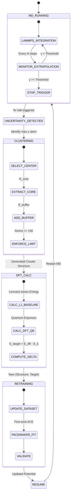

# ACE-Active-Carver System Architecture

## 1. System Overview
**ACE-Active-Carver** is an uncertainty-driven active learning system for Molecular Dynamics (MD). It uses the **MaxVol $\gamma$** metric from the ACE potential (Pacemaker) to detect high-uncertainty configurations during an MD simulation. When uncertainty exceeds a threshold, the system pauses, extracts a local cluster, performs a reference DFT calculation (Quantum Espresso), updates the potential (Delta-Learning), and resumes the simulation.

## 2. System Architecture & State Machine

### State Diagram (Mermaid)

## 3. Component Responsibilities

### A. Controller (`ActiveLearningController`)
The central orchestrator of the system.
*   **Responsibilities**:
    *   Manages the main event loop and state transitions.
    *   Instantiates and calls sub-components (MDEngine, Carver, Labeler, Trainer).
    *   Handles configuration loading (thresholds, paths).
    *   Logging and checkpointing the active learning cycle.
*   **Key Methods**:
    *   `run_loop()`: Main entry point.
    *   `check_termination()`: Decides when to stop the AL loop (max cycles or time).

### B. MD Engine (`LammpsMDEngine`)
Wrapper around the Python `lammps` module.
*   **Responsibilities**:
    *   Configures LAMMPS with the current ACE potential.
    *   Sets up `pair_style pace/extrapolation`.
    *   Configures `fix halt` to stop simulation when extrapolation grade $\gamma$ exceeds the threshold.
    *   Provides access to the current system state (positions, forces, MaxVol grades) when halted.
*   **Key Configuration**:
    *   Input: `start.lmps`, `potential.yace`.
    *   Logic: `fix 1 all halt ${check_freq} v_gamma > ${threshold} error hard` (or similar logic to exit clean).

### C. Cluster Carver (`ClusterCarver`)
The "Brain" responsible for efficient geometry extraction.
*   **Responsibilities**:
    *   **Center Selection**: Identifies the atom index with the maximum $\gamma$ value from the halted snapshot.
    *   **Region Definition**:
        *   **Core ($R_{core}$)**: Atoms within this radius of the center. These atoms will have forces trained.
        *   **Buffer ($R_{buffer}$)**: Atoms between $R_{core}$ and $R_{buffer}$. Used to provide correct chemical environment/boundary conditions.
    *   **Constraint Enforcement**: Ensures total atom count $\le 100$. If $N > 100$, strictly reduces $R_{buffer}$ (or $R_{core}$ if necessary) to meet the limit.
    *   **Masking Generation**: Creates a selection mask where Core atoms = True (train forces), Buffer atoms = False (ignore forces).
*   **Output**: An `ase.Atoms` object representing the cluster.

### D. Labeler (`DftLabeler`)
The Oracle providing ground-truth data.
*   **Responsibilities**:
    *   **Delta-Learning Logic**:
        *   Calculates $E_{LJ}$ (Lennard-Jones baseline) for the cluster using an internal calculator (e.g., ASE LJ).
        *   Runs Quantum Espresso (QE) to get $E_{DFT}$ and $F_{DFT}$.
        *   Computes Targets: $E_{target} = E_{DFT} - E_{LJ}$, $F_{target} = F_{DFT} - F_{LJ}$.
    *   **Execution**: Manages QE input generation, execution (via `mpirun` or SLURM), and parsing.
*   **Output**: Labeled structure ready for Pacemaker.

### E. Trainer (`AceTrainer`)
Wrapper for Pacemaker tools.
*   **Responsibilities**:
    *   **Dataset Management**: Appends the new labeled cluster to the training set (`data.pckl.gzip` or `.xyz`).
    *   **Fitting**: Invokes `pacemaker` command to fine-tune the potential.
    *   **Versioning**: Saves the new `potential.yace` with a version tag/timestamp.
*   **Strategy**: Likely uses a "fine-tuning" approach (initializing weights from previous potential) to minimize cost.

## 4. Data Flow

1.  **MD Phase**:
    *   **Input**: `current_potential.yace`, Initial Structure.
    *   **Process**: LAMMPS runs. `pace/extrapolation` computes $\gamma$ per atom.
    *   **Trigger**: Max $\gamma >$ Threshold.
    *   **Output**: Halted State (Snapshot of all atoms + $\gamma$ values).

2.  **Carving Phase**:
    *   **Input**: Halted State.
    *   **Process**: `ClusterCarver` finds max-$\gamma$ atom -> Selects neighbors within $R_{buffer}$ -> Prunes to $<100$ atoms.
    *   **Output**: `cluster.xyz` (ASE Atoms object).

3.  **Labeling Phase**:
    *   **Input**: `cluster.xyz`.
    *   **Process**:
        *   Compute $V_{LJ}(cluster)$.
        *   Run DFT on `cluster`.
        *   Subtract: Target = DFT - LJ.
    *   **Output**: `labeled_cluster.xyz` (with energy/forces/virials properties set to Delta values).

4.  **Training Phase**:
    *   **Input**: `labeled_cluster.xyz`, `previous_dataset.p7z`.
    *   **Process**: Merge data -> Run `pacemaker` optimization.
    *   **Output**: `new_potential.yace`.

5.  **Resume Phase**:
    *   **Input**: `new_potential.yace`, Last MD Checkpoint.
    *   **Process**: Update LAMMPS pair_style -> Continue dynamics.
